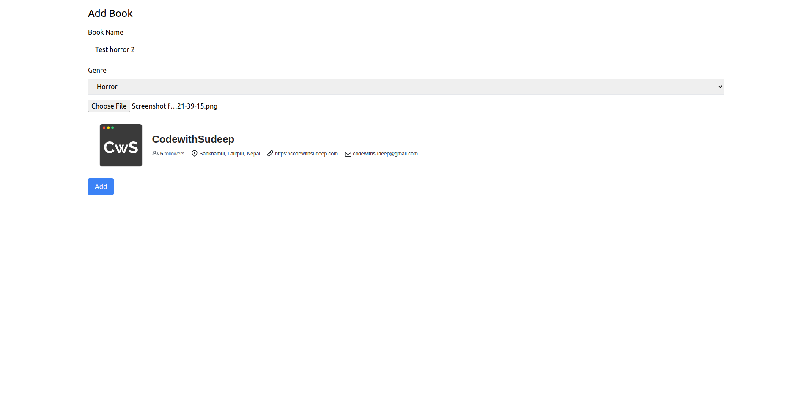
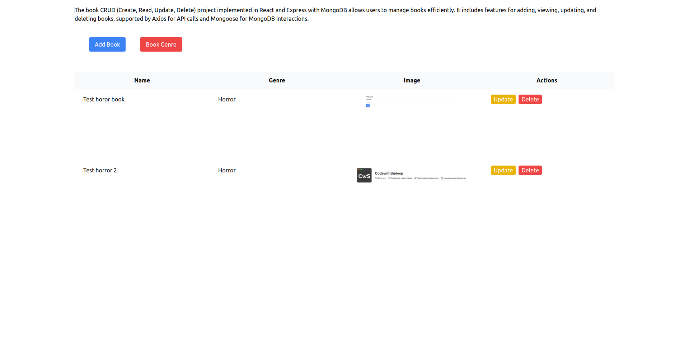
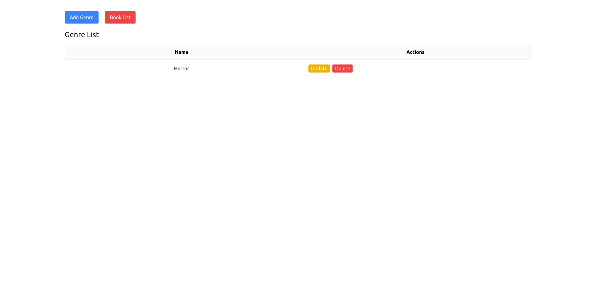
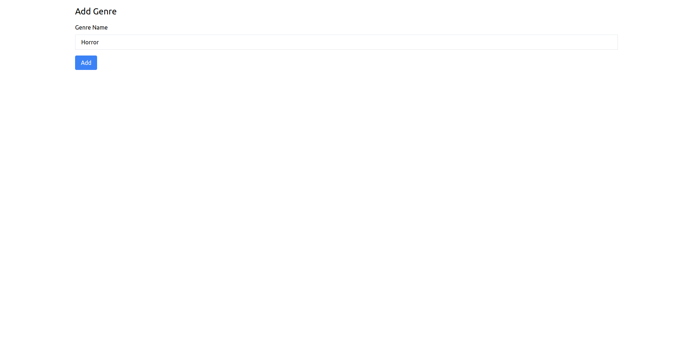
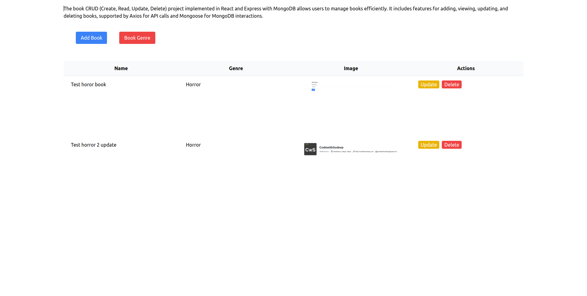
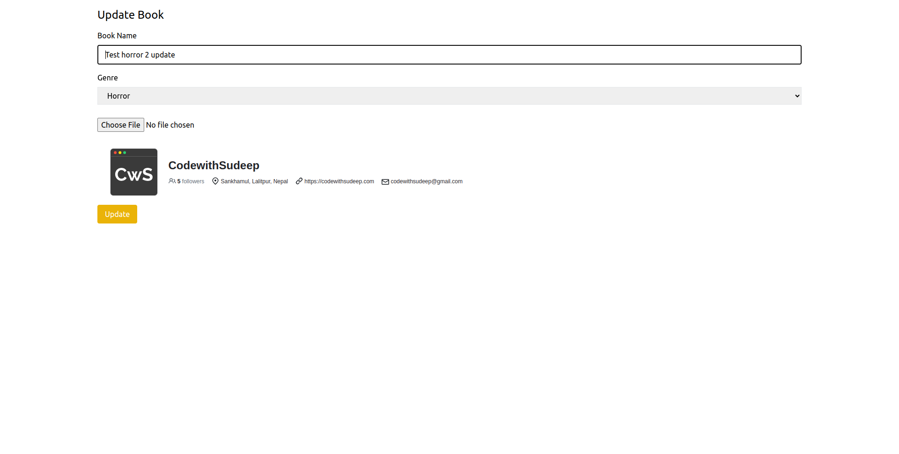
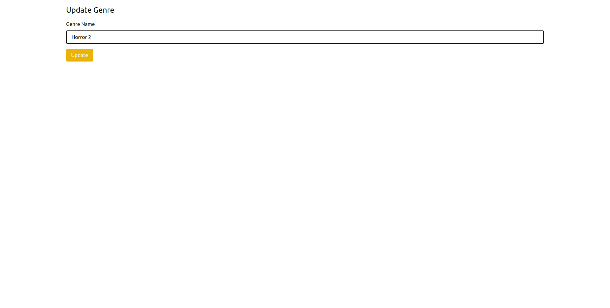

Creating a README file for a project that involves CRUD operations for books stored as BLOBs in a MongoDB database requires clear documentation to guide users and developers on how to set up, use, and understand the project. Below is an example of what your README file might look like:

---

# Book CRUD Application with MongoDB

This project is a full-stack application for managing books using React for the frontend, Express with MongoDB for the backend, and storing book images as BLOBs in the database.











## Table of Contents

- [Features](#features)
- [Technologies Used](#technologies-used)
- [Getting Started](#getting-started)
  - [Prerequisites](#prerequisites)
  - [Installing Dependencies](#installing-dependencies)
  - [Setting Up MongoDB](#setting-up-mongodb)
  - [Running the Application](#running-the-application)
- [Usage](#usage)
  - [Adding a Book](#adding-a-book)
  - [Updating a Book](#updating-a-book)
  - [Deleting a Book](#deleting-a-book)
- [Contributing](#contributing)
- [License](#license)

## Features

- CRUD operations for books (Create, Read, Update, Delete)
- Image uploads for book covers stored as BLOBs in MongoDB
- Responsive UI with React and Tailwind CSS

## Technologies Used

- **Frontend**: React, Tailwind CSS
- **Backend**: Node.js, Express.js
- **Database**: MongoDB (using Mongoose for ODM)
- **File Storage**: Storing book images as BLOBs in MongoDB
- **Other Tools**: Axios for API requests, Multer for handling file uploads

## Getting Started

To get a local copy of the project up and running, follow these steps:

### Prerequisites

- Node.js installed on your machine
- MongoDB installed locally or access to a MongoDB instance (local or cloud)

### Installing Dependencies

1. Clone the repository:

   ```bash
   git clone https://github.com/your-username/book-crud-app.git
   cd book-crud-app
   ```

2. Install frontend and backend dependencies:

   ```bash
   # Install backend dependencies
   cd backend
   npm install
   
   # Install frontend dependencies
   cd ../frontend
   npm install
   ```

### Setting Up MongoDB

1. Make sure MongoDB is running either locally or accessible remotely.

2. Create a MongoDB database and configure connection settings in `backend/server.js`.

### Running the Application

1. Start the backend server (from `backend` directory):

   ```bash
   npm start
   ```

   The server will run on `http://localhost:5000` by default.

2. Start the frontend development server (from `frontend` directory):

   ```bash
   npm start
   ```

   The frontend will run on `http://localhost:3000` by default.

3. Open your browser and navigate to `http://localhost:3000` to view the application.

## Usage

### Adding a Book

1. Click on the "Add Book" button.
2. Fill in the book details and select an image file for the book cover.
3. Click "Add" to save the book.

### Updating a Book

1. Navigate to the book you want to update.
2. Click on the "Update" button.
3. Modify the book details or update the book cover image.
4. Click "Update" to save the changes.

### Deleting a Book

1. Navigate to the book you want to delete.
2. Click on the "Delete" button.
3. Confirm the deletion when prompted.

## Contributing

Contributions are welcome! Fork the repository, make your changes, and submit a pull request.

## License

This project is licensed under the MIT License - see the LICENSE file for details.

---

Replace `screenshot.png` with an actual screenshot of your application. This README file provides a structured guide for users and developers to understand and use your book CRUD application effectively. Adjust paths and instructions as necessary based on your project's folder structure and specific configurations.